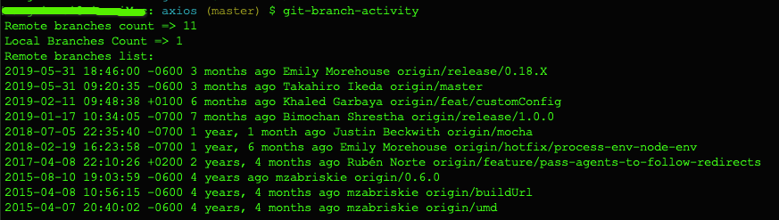

git-branch-activity
===================

view local and remote git branches commit activity

# Install #

```bash
$ npm install git-branch-activity -g
```

# Usage #

```bash
$ cd your-project-directory
$ git-branch-activity
```

# Snapshot # 
